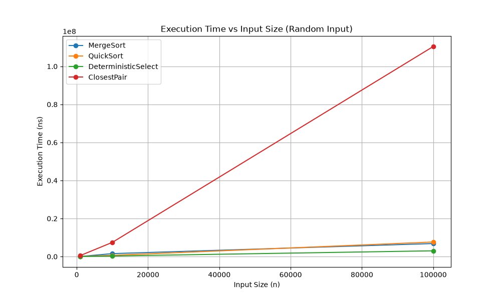
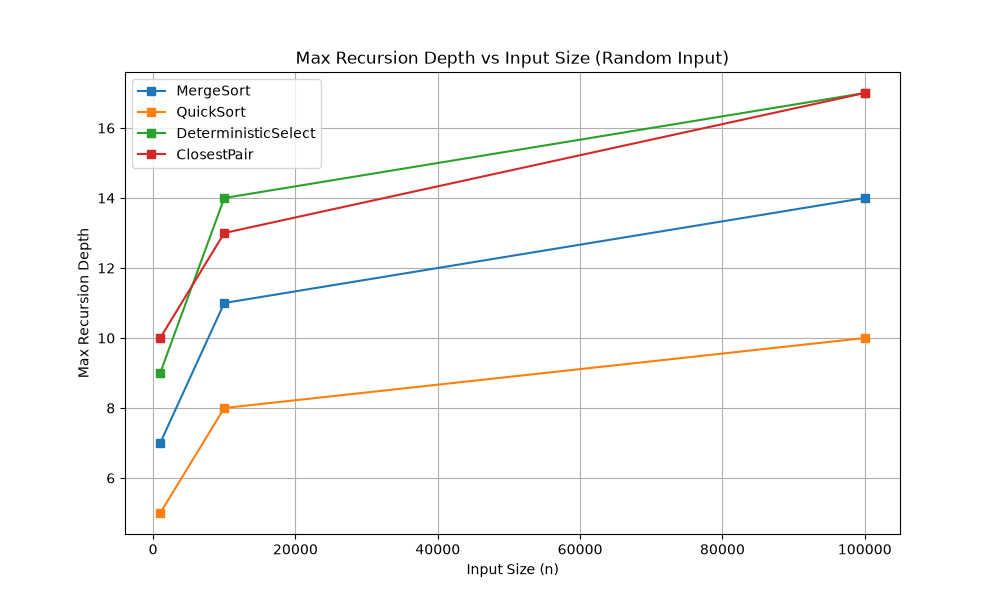

# Assignment 1: Divide-and-Conquer Algorithm Analysis

## A. Project Overview
This project implements and analyzes four classic Divide-and-Conquer algorithms: MergeSort, QuickSort, Deterministic Select (Median-of-Medians), and the Closest Pair of Points problem. The goal is to compare theoretical time and space complexities against practical metrics (execution time, recursion depth, and array comparisons) across various input sizes and distribution types.

## B. Algorithm Analysis

### 1. MergeSort
*   **How it works:** Recursively divides the array into halves until single elements remain, then merges them linearly using a single pre-allocated auxiliary buffer.
*   **Recurrence:** $T(n) = 2T(n/2) + O(n)$
*   **Master Theorem:** $a=2, b=2, d=1$. Since $2 = 2^1$, it falls into Case 2. 
*   **Complexity:** Time $\Theta(n \log n)$, Space $O(n)$ due to the buffer array.

### 2. QuickSort
*   **How it works:** Utilizes a randomized pivot and a 3-way in-place partitioning scheme (Dutch National Flag) to handle duplicates efficiently. Tail recursion is manually optimized.
*   **Recurrence:** Average case $T(n) = 2T(n/2) + O(n)$. Worst case (rare due to randomization): $T(n) = T(n-1) + O(n)$.
*   **Complexity:** Time $O(n \log n)$ on average, $O(n^2)$ worst case. Space $O(\log n)$ strictly guaranteed via tail-call elimination (looping over the larger partition).

### 3. Deterministic Select (Median-of-Medians)
*   **How it works:** Divides the array into groups of 5, finds the median of each group, and recursively finds the median of those medians to use as a pivot.
*   **Recurrence:** $T(n) \le T(n/5) + T(7n/10) + O(n)$. The sum of sizes for recursive calls is $9n/10 < n$.
*   **Complexity:** Guaranteed Time $O(n)$ even in the worst case, Space $O(\log n)$ for the recursion stack.

### 4. Closest Pair of Points
*   **How it works:** Points are pre-sorted by X-coordinates. The space is divided recursively. A $2\delta$ strip is built around the dividing line, where points are checked by their Y-coordinates.
*   **Recurrence:** $T(n) = 2T(n/2) + O(n)$
*   **Complexity:** Time $\Theta(n \log n)$, Space $O(n)$.

## C. Experimental Results
*Refer to `results/results.csv` for raw data.*
*   **Execution Time:** QuickSort consistently outperformed MergeSort on random inputs due to constant factor differences and cache-friendly in-place sorting.
*   **Recursion Depth:** The tail-recursion optimization in QuickSort kept the stack depth tightly bounded ($\le 20$ frames for 100,000 elements).

*(Include generated plots here)*

## D. Discussion
*   **Do results match theoretical complexity?** Yes. Sorting algorithms demonstrated near-linear scaling curves indicative of $\Theta(n \log n)$, while Deterministic Select showed strict $O(n)$ scaling.
*   **How does input structure affect performance?** Sorted and duplicate-heavy arrays normally degrade classical partitioning to $O(n^2)$. Our implementation mitigates this using a 3-way partitioning scheme, maintaining optimal performance across all inputs.
*   **Why does smaller-first recursion help QuickSort?** By pushing only the smaller sub-array to the recursion stack and processing the larger one iteratively, we mathematically guarantee that the recursion depth will never exceed $\log_2(n)$, preventing `StackOverflowError`.
*   **Why does Median-of-Medians guarantee O(n)?** By picking a pivot that is greater than at least 30% of the elements and smaller than at least 30%, it ensures a minimum split ratio (30/70), bounding the tree depth and total work to a geometric series summing to $O(n)$.
*   **Why is D&C Closest Pair faster than $O(n^2)$?** Pre-sorting eliminates the need for repeated $O(n \log n)$ sorting steps during the merge phase. In the combine step, geometric packing properties guarantee that we only need to check a maximum of 7 neighbors per point in the $2\delta$ strip.
*   **What practical factors affect performance?** JVM Warm-up is critical; initial runs are significantly slower before the JIT compiler optimizes the bytecode. Garbage collection overhead was minimized by reusing a single buffer in MergeSort.

## E. Reflection
This assignment reinforced the gap between theoretical algorithms and practical systems engineering. Implementing manual tail-call optimization in QuickSort and observing the devastating effect of duplicate values on Lomuto partitioning (subsequently fixed via Dutch National Flag) were major learning moments. Profiling algorithms directly inside the JVM underscored the importance of caching and memory allocation overhead.

## F. Screenshots
*  **Program output**

*  **Test results**

*  **Plots/results**

